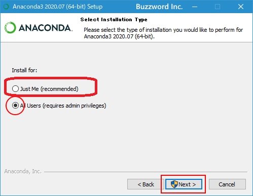
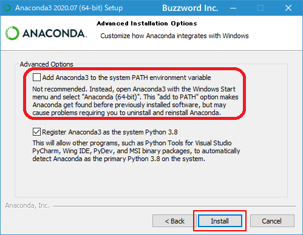

# ANACONDAインストールの説明

- インストール
- アップデート
- 削除
-----------------------------------
### インストール

https://www.anaconda.com/

このサイトのDownload ページから、適するパッケージ（OS, 64-Bit/32-Bit など）を選択
以下では、Anaconda for Windows (Python 3.8, 64-Bit)のインストールを説明します。

サイトはたびたび，そのデザインが変更されているので，各自で適するインストール解説サイトを探すなどを行ってください。

ここでは，次のサイトを参照します。
- Anacondaのインストール: https://www.javadrive.jp/python/install/index5.html

このサイトの補足内容として次を説明します。
- ダウンロードファイルを「管理者として実行」（Windowsの仕様），これを選択する。
- インストールで現れるウィンドウでオプションをどのようにするかを聞かれますが，ディフォルト（次のウィンドウの場合”Next”）を選んで進む。
- ただし，**下記の2点は何を選ぶか注意深く行ってください。**

#### 1. Install for 誰を対象？

上記のサイトの説明では All Usersを選んでいますが，特に理由が無ければ，推奨（recommended）のJust Meを選んでください。

 

<!--- 右では小さい　 --->


この選び方で，ANACONDAのインストールされる場所が変わります。
以下の説明は，Just Meの場合の場所（PATH）としています。


#### 2. PATHの選択

上記のサイトの説明において， Advanced Optionsで1番目のチェックを入れていません。

1番目の意味は，ANACONDAのパスを，ユーザが独自に設定するか否かです。

 

<!--- 右では小さい　 --->

このため，チェックを入れていないと，インストール終了後に，ユーザは自ら幾つかのパスを設定しなければなりません。
この設定が面倒と考えるならば，チェックを入れてください。

チェックを入れると1番目の項目の文章は <strong>赤文字</strong> に変わります。

1番目の項目にチェックを入れず，1番目でJust Meを選んだ場合，
次のPATHをユーザ自身で環境設定のPATHに追加してください。

- C:\PATH\Anaconda3;
- C:\PATH\Anaconda3\Library\mingw-w64\bin;
- C:\PATH\Anaconda3\Library\usr\bin;
- C:\PATH\Anaconda3\Library\bin;
- C:\PATH\Anaconda3\Scripts;

ここに，PATHはAnaconda3があるパスです。

-----------------------------------
### アップデート

- 管理者権限でコンソール（WindowsはプロンプトかPowerShell）を起動する
- C:\> conda update --all


-----------------------------------
### 削除（アンインストール）

幾つか方法があり，他の方法は各自で調べてください。
ここでは次の方法を紹介します。

1. 次をインストールする
```
> conda install anaconda-clean
```

2. 次を実行する
```
> anaconda-clean
```
色々なツールを削除するか問われるので，迷わず全てyesを入力する。

3. Anacondaフォルダの削除
実は，まだ，Pythonは起動するのでAnacondaフォルダを削除する。上記のインストールでは，次にある。

```
C:\ProgramData\Anacconda3
```
コマンドからでもよいが，GUI操作（マウスを使って）でも削除できる。

4. Pathの削除

インストール時のPathが残っているので，この削除を行う。
Windowsの場合

「コントロールパネル」→「システムとセキュリティ」→「システム」→「システムの詳細設定」を開く。

この中から「環境変数」を開き，このなかで変数“Path”を修正する。

この方法は次を参照しています。

https://torisetsublog.com/anaconda-uninstall/#:~:text=%E3%81%BE%E3%81%9A%E3%81%AF%E3%80%81Windows%E3%82%A8%E3%82%AF%E3%82%B9%E3%83%97%E3%83%AD%E3%83%BC%E3%83%A9%E3%83%BC%E3%82%92%E4%BD%BF%E7%94%A8,%E3%82%92%E5%AE%9F%E8%A1%8C%E3%81%97%E3%81%A6%E3%81%8F%E3%81%A0%E3%81%95%E3%81%84%E3%80%82

以上