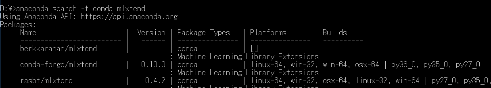

# condanとpipの使い方
#### condaとpipの違いに関心のある読者の方へ
Anaconda環境では，なるべくcondaコマンドで様々な操作を行うことを勧めます。
condaとpipの混合操作は依存関係やパッケージ削除などで混乱が生じる可能性があります。
ただ，pipでインストールせざるを得ないパッケージもあり，このインストール方法も説明します。


#### 目次
1. Getting started
2. パッケージの管理
3. Pythonの異なるバージョンの仮想環境作成
4. pipの使い方
5. condaとpipの比較

----------------

## 1. Getting Started

初めに，Anacondaのインストールと環境設定が完了していること。
Anacondaが存在するパスは次である。（Windows10の場合，他のOSは他書を参照）。

- [All Users]でインストールした場合
     C:\ProgramData\Anaconda3
- [Just Me]でインストールした場合
     C:\Users\user_name\Anaconda3

condaコマンドのドキュメント類は次にある。

- Conda HP: https://conda.io/
- Full documentation: https://conda.io/docs/.
- Getting Started: https://conda.io/docs/user-guide/getting-started.html
- Managing packages: サイトhttps://docs.conda.io/ 内で"Managing packages"を検索 
- Command reference （コマンドオプションなど）: サイトhttps://docs.conda.io/ 内で"Command reference"を検索

なお，ここの説明ではWindowsのコマンドプロンプト（またはPowerShell）内でのコマンド操作を次のプロンプト（”>”）を用いて行っているものとする。

```
> command
```

#### バージョンを見る

```
> conda --version
```


#### アップデート 
Anacondaのアップデートは、管理者権限でコマンドプロンプトを起動し、次のようにする。

```
> conda update conda
Proceed ([y]/n)? y
```

または

```
> conda update --all
```


#### Anacondaの環境表示

```
> conda info -e  

# conda environments:  
#  
base      *  C:\ProgramData\Anaconda3  
```

もし，Anaconda仮想環境で Pythonの他のバージョンを作成していれば，その情報が上記に現れる。

--------------------------------
## 2. パッケージの管理

#### インストール済みのパッケージリスト表示

```
> conda list
> conda list numpy
> conda list --export > env.txt
```

Anacondaが含むパッケージは，次のサイトで対応するOSをクリックすると見られる。
https://docs.anaconda.com/anaconda/packages/pkg-docs

Rのパッケージの幾つかのリストが次にある。  
https://docs.anaconda.com/anaconda/packages/r-language-pkg-docs

これらも，Anacondaパッケージと同様にしてインストールできる。ただし，環境構築用のパッケージもあり，これらは別の注意を必要とするので，各自で調べること。

#### パッケージの検索

```
> conda search beautifulsoup4
> conda search パッケージ名
```

しかし，これだけでは，Anacondaのdefaultsクラウドで管理しているものだけを検索することになる。他にAnacondaクラウドには，開発元別に多数のパッケージがある。例えば，

- conda-forge https://conda.anaconda.org/conda-forge
- Menpo https://anaconda.org/menpo/

これらを網羅して一括で検索するコマンドが次である。

```
> anaconda search -t conda パッケージ名
```

次の例は，mlxtendというパッケージを検索している。

    mlxtend: 学習曲線のプロットで用いるパッケージ（外部ライブラリとも称する）
    https://anaconda.org/conda-forge/mlxtend　（ここにcondaを用いたインストール法あり）
    https://conda-forge.org/feedstocks/

```
> anaconda search -t conda mlxtend
```

 

<!--- 右では小さい　 --->

上図で，注目すべきなのはトップにある項目で，左から
- Name   チャネル名/パッケージ名
- Platforms パッケージの稼働確認したOS
- Builds  　パッケージの稼働確認したPythonのバージョン
- パッケージをインストールする前に，PlatformsとBuildsの確認を行うこと

#### 表示されたパッケージの確認

上記のName欄をスラッシュ’/’　付きで次のように入力する。
```
> anaconda show conda-forge/mlxtend
Using Anaconda API: https://api.anaconda.org
Name:    mlxtend
Summary: Machine Learning Library Extensions
Access:  public
Package Types:  conda
Versions:
   + 0.7.0
   + 0.8.0
   + 0.9.0
   + 0.9.1
   + 0.10.0

To install this package with conda run:
     conda install --channel https://conda.anaconda.org/conda-forge mlxtend
```

この表示の最後の行に，インストール法が示されるので，この通りに入力すればパッケージmlxtendのインストールを行える。

コマンドオプションの””--channel” はどのチャネルを通してパッケージにアクセスできるかを示している。また，https://conda.anaconda.org/チャネル名　の場合は，省略して “--c チャネル名”とすることもできる。


#### パッケージのインストール

注意：Windowsの場合，コマンドプロンプトは管理者権限で起動すること。

conda search で見つかった場合

```
> conda install パッケージ名
```

anaconda search -t conda で見つかった場合
```
> conda install --channel　チャネル名　パッケージ名
```

#### パッケージのアップデート
```
> conda update パッケージ名
```

**注意:** 
SciPyのアップデートは次の様にinstall，かつ，バージョン番号を指定することで行えた。

```
> conda install scipy==1.5.2
```


#### パッケージのアンインストール
```
> conda uninstall パッケージ名   # uninstallの代わりにremoveでも可
```
注意：他のインストールコマンドであるpipでインストールしたパッケージはpipで削除すること。


--------------------------------

## 3. Pythonの異なるバージョンの仮想環境作成


#### インストール済みのパッケージリスト表示


```
> conda search --full-name python
```

#### 仮想環境の作成
conda create -n <環境名> python=<バージョン> <スペース区切りでライブラリ名>

```
> conda create -n py2 python=2.7 numpy scipy pandas jupyter
```

Python 2.7系を使える環境作成かつanacondaとしてまとめて入れることも可能。
```
> conda create -n py27 python=2.7 anaconda
```

#### 仮想環境の確認
```
> conda info -e

# conda environments:
#
chainer                  /home/user/anaconda2/envs/chainer
py27                     /home/user/anaconda2/envs/py27
py35                     /home/user/anaconda2/envs/py35
root                   *  /home/user/anaconda2
```

#### 仮想環境の出入り

仮想環境に入る

```
> source activate py2		# windowsではactivate py2
```


仮想環境から抜ける

```
> source deactivate		# windowsではdeactivate
```

#### 仮想環境の削除
```
> conda remove -n py2 --all
```

#### その他
Rの仮想環境の作成

Rの仮想環境作成パッケージの幾つかのリストが次にある。
https://docs.anaconda.com/anaconda/packages/r-language-pkg-docs
この中で，JupyterにR使用の環境作成が次で行えることがわかる。
```
> conda create -n R -c r r-irkernel
```


--------------------------------

## 4. pipの使い方

condaではインストールできないパッケージがある。この場合，pipコマンドを用いる。Anacondaには，pip（下記のpip3）を含んでいる。

#### 注意：

Python2.7系とPython3系の両方を有している場合，
- Python2.7系向けインストールには，pip   コマンドを使用
- Python3系向けインストールには，   pip3 コマンドを使用

##### Python3系のみを有している場合には，pip, pip3どちらを用いても構わない。

Reference Guid https://pip.pypa.io/en/stable/reference/ 

#### pip自身のアップグレード
```
> python -m pip install --upgrade pip
```

#### パッケージの検索
```
> python -m pip search <パッケージ名，または，キーワード>
```

#### パッケージのインストールとアンインストール
```
> python -m pip install <パッケージ名>
> python -m pip install numpy==1.11.0
> python -m pip uninstall  <パッケージ名>
```

**注意：** pipでインストールしたパッケージはcondaで削除できないので，pipで削除すること．

--------------------------------

## 5. condaとpipの比較

次を参照されたい。
- Condaの説明: https://docs.conda.io/
- Understanding Conda and Pip: https://www.anaconda.com/blog/understanding-conda-and-pip

NumPyのインストールはcondaの方がpipより良いとの報告がある（真偽はまだ確かめていません）。
- Stop Installing Tensorflow using pip for performance sake!: https://towardsdatascience.com/stop-installing-tensorflow-using-pip-for-performance-sake-5854f9d9eb0c
- AnacondaのNumPyとPyPIのNumPyの速度を比較する: https://minus9d.hatenablog.com/entry/2018/07/21/232121
- conda installとpip installの違い。機能の比較など【Python】: https://insilico-notebook.com/conda-pip-install/
