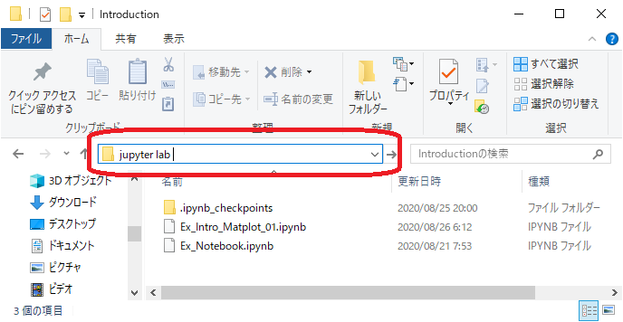
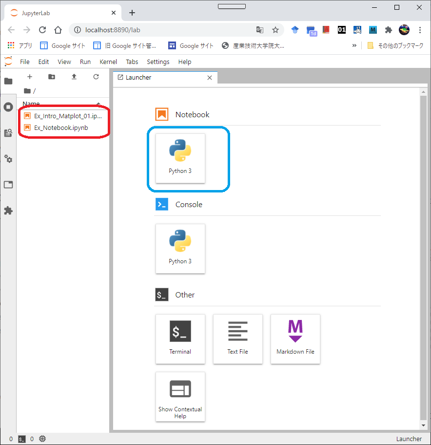
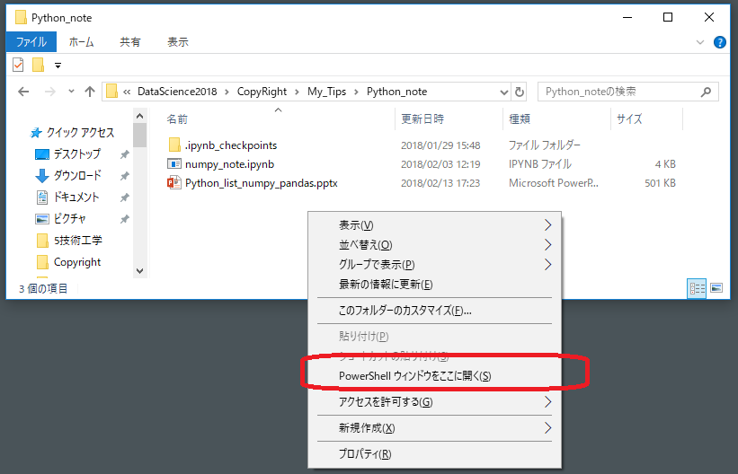

# 統合開発環境（IDE）の使い方

主として，Jupyter Notebook（**Notebook**と略称，**拡張子".ipynb"**）の使い方を説明します。

IDEはJupyterLabとしますが，JupyterLabは幾つかのアプリケーションを管理しており，
この中にNotebookやスクリプトなどがあります。
JupyterLabというIDEの中で，実質的な開発・実行はNotebookを用いることになります。

クラウドでのIDEとしてGoogle Colaboratory（**Colab**と略称）の簡単な説明を行います。
この書き方と実行はNotebookとほぼ同じですので，Notebookの書き方や実行の仕方を知っておいてください。

最後に，開発環境はJupyter NotebookでなくJupyterLabに移行するとのアナウンスがあることをお知らせします。

- JupyterLabアナウンス: https://github.com/jupyterlab/jupyterlab
- JupyterLabを使ってみよう: https://esrijapan.github.io/arcgis-dev-resources/tips/python/python-api-jnlabsetup/

再度述べますが，JupyterLabの中でNotebookを開発実行する，という枠組みで説明を行います。

1. JupyterLab/Jupyter Notebookの起動
2. [Notebookの使い方](./UsageNotebook.md)
3. [Colabの使い方](./UsageColab.md)
------------------------------------------------------------------------------
## 1. JupyterLab/Jupyter Notebookの起動

Windows10のもとでのJupyterLabの起動の仕方を説明します。
Jupyter Notebookの起動も同じで，下記の説明で"JupyterLab"を"Jupyter Notebook"と置き換えるだけです。

2つの起動方法を示します。
いずれも，Anacondaがインストールされており，**Anacondaへのパスが通っている**ことを前提とします。

#### 方法1
Notebookなどのプログラムがある作業フォルダをカレントフォルダとし，このフォルダに移動します。
このカレントフォルダのアドレスバーに直接"jupyter lab"と入力すると，
コマンドウィンドウが起動，この後に，Webブラウザの中でJupyterLabが起動します。

 

<!--- 右では小さい　 --->

JupyterLabのオープニングページが次で，
- 既存の".ipynb"があれば（赤枠内），このファイルをクリックして編集を続行する。
- 新規にNotebookを作成したいばあには，青枠をクリックする。
 
<!--- 右では小さい　 --->


#### 方法2
カレントフォルダのウィンドウにカーソルを当てて，**Shiftキー+右クリック**すると，
次図のようにサブウィンドウが開き，この中の[PowerShellウィンドウをここに開く]をクリックする。
（**注意:** PC環境によると，[コマンド ウインドウをここで開く]になる場合があり，これを利用する）

 

このコマンドプロンプトで次のコマンドを実施する。
```
> jupyter lab
```
（この代わりに"jupyter notebook"を入力すれば，直接Jupyter Notebookが起動する）

-----------------------------------------------

### JupyterLabの終了
メニュー[File] &rarr; [Log Out]

で終了します。この後，ブラウザを閉じてください。

PowerShell（またはコマンドプロンプト）も閉じてください。