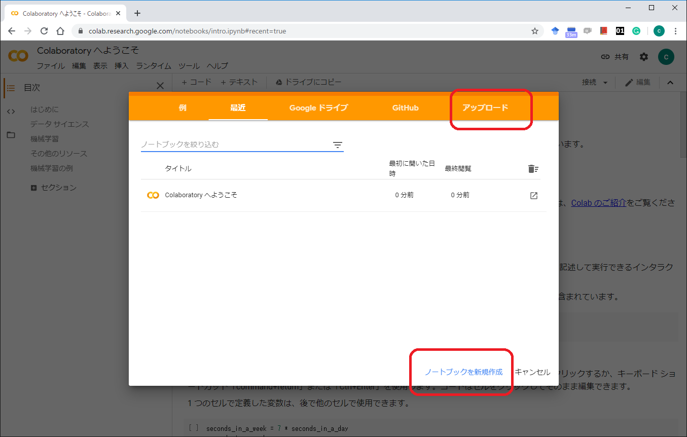
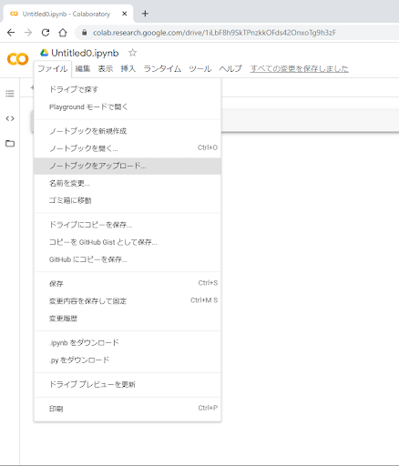
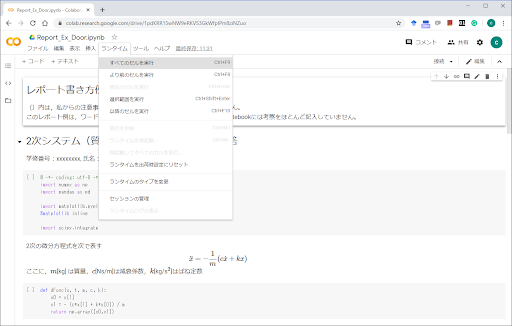
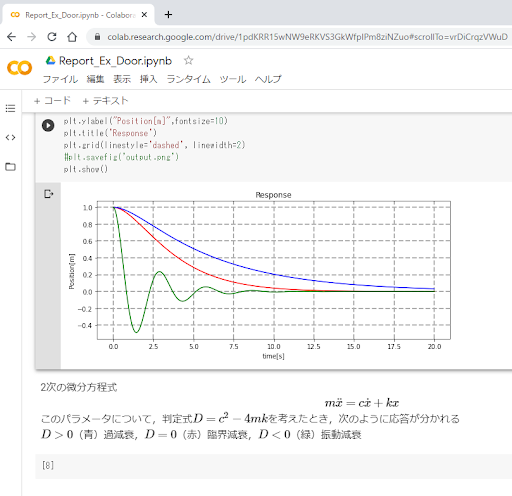
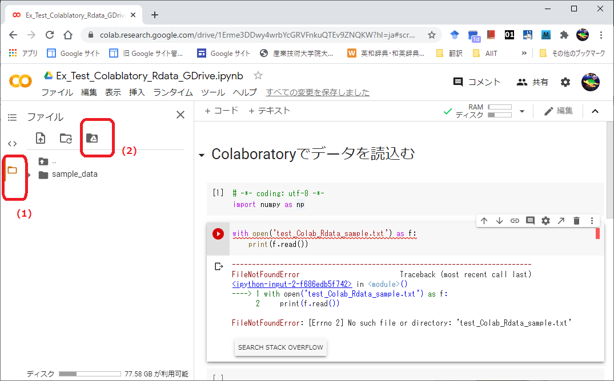
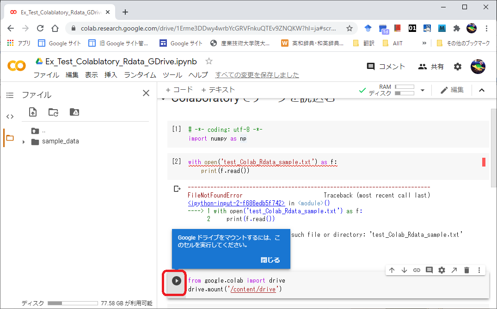
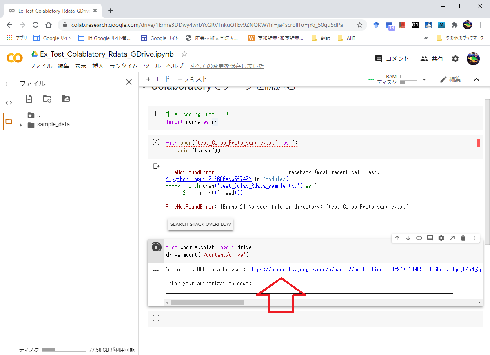
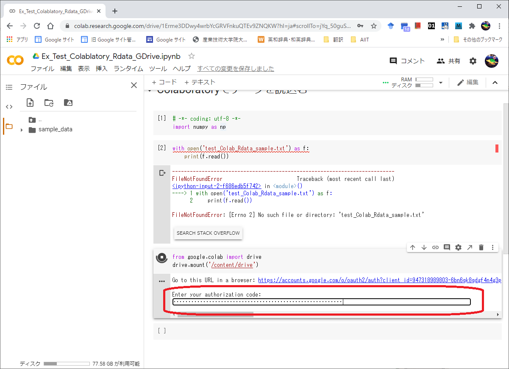
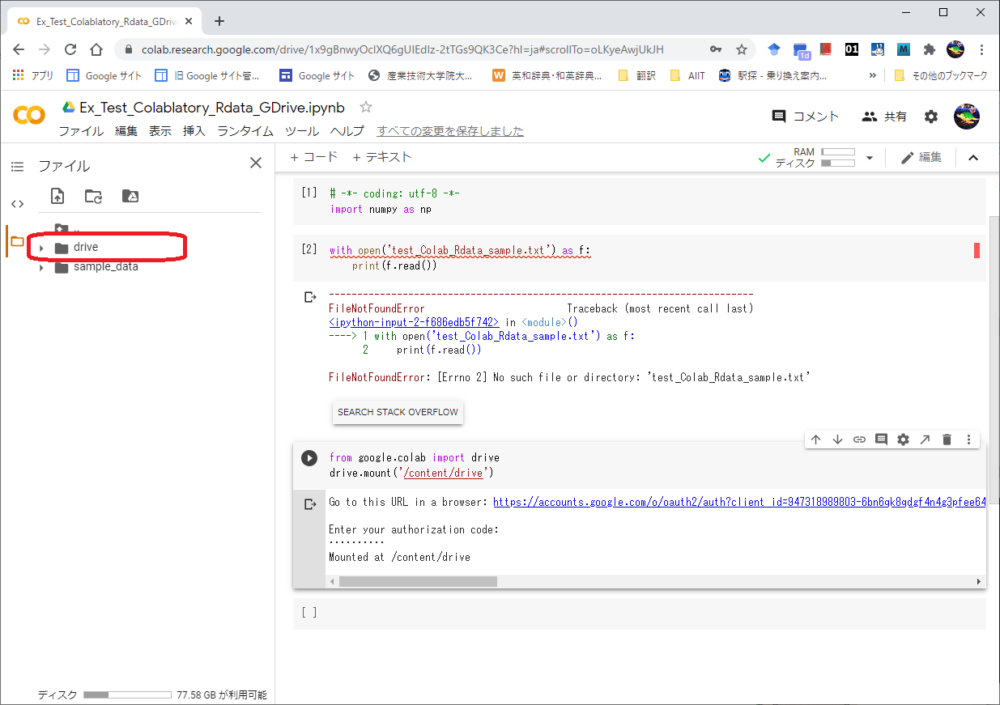
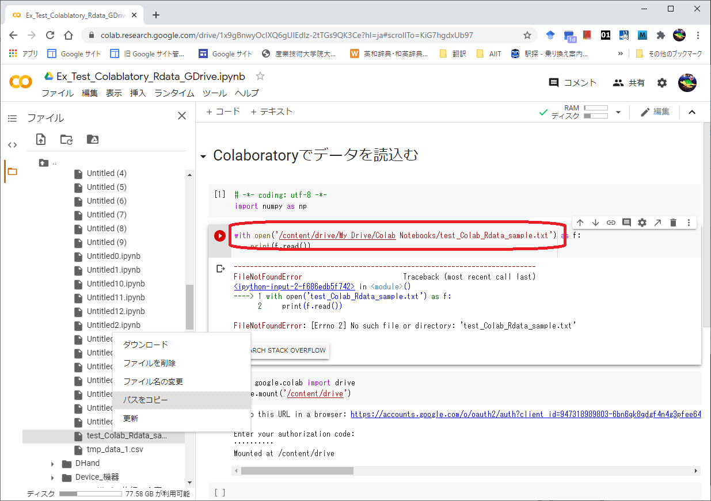

# Colaboratoryの使い方


Colabとも略されます。
下記は，ブラウザChrome, OS Windows10を用いて説明していますが，
他のブラウザやOSでも使用できます（一部できないものもあります）。
PC以外で，スマホ＋Chromeの動作も確認していますが，見にくく，スクリプトの変更が大変手間がかかります。

**注意**：Colab内のパッケージのバージョンは，Anacondaのそれよりも古いものがあります。よって，Colab上で実行エラーが生じたとき，まずは，パッケージのバージョンを確認してください。または，本Tipsの中のNoteErrorsを見てください。

--------------------------------------------------------------------------------

#### Colabができないこと
- PCの音源を鳴らす：原理的に難しい
- アニメーションの一部表示（2020年10月現在）
- Cartopyの利用：本パッケージはローカルディスクに幾つかの地理空間ファイルを置くが，これをクラウドに置くことができない。

----------------------------------------------------------------------------

#### 目次
- 概要
- さあ始めよう
- 便利に使うTips（特にバージョン管理に注意）
---------------------------------------------------------------------------
# 概要
#### Colaboratoryを使用できるための必須条件
- Googleのアカウントを持っていること
    - アカウントを新たに作る場合 &rarr; https://support.google.com/accounts/answer/27441?hl=ja
- インターネットに接続していること
- Google ドライブの使い方を知っている

#### Colaboratoryとは
Colab（略称）は，クラウドで実行され，Jupyter NotebookをGoogleドライブに保存する無料のJupyter Notebook環境です。
よって，Googleドライブの使い方も知っておく必要があります。
ColaboratoryはProject Jupyterの一部として始まり，この後の開発はGoogle（米国）に引き継がれた。
ユーザは，Googleのアカウントを有しているという前提で，インターネット接続されて適当なブラウザを有するPCを用意するだけでよく，Jupyter Notebookの使い方に慣れていれば，直ちに使用することができる。
Colabは，強力な計算パワーを提供している。

**使用時間制限**があるため，開発中のNotebookはGoogle ドライブに保存することが推奨されている。

**データのアクセス（入出力）**について，クラウドコンピューティングの性質上，Googleドライブとリンクして， ドライブ上でデータのアクセスを行うようにします。

初めて使う場合には，次を参照すると良い。

-“Colaboratory へようこそ”　https://colab.research.google.com/notebooks/welcome.ipynb


#### Colabが有するライブラリ
※Googleはパッケージと言わず、ライブラリと言う。

Importing a library that is not in Colaboratory　

https://colab.research.google.com/notebooks/snippets/importing_libraries.ipynb

Colaboがデフォルトで有するライブラリの一部

numpy, scipy, matplotlib, pandas, statsmodels
sklearn
mlxtend, seaborn
cv2 (OpenCV ver.3)

#### Colabに含まれないライブラリのインストール
**ModuleNotFoundError**が出た場合，インストールは次の方法があります。
#### 1. Colabがインストールを促す場合
セルの下側に，**INSTALL 当該ライブラリ名**が現れた場合，このボタンをクリックすると，セルにインストールするためのスクリプトが挿入されます。このセルを実行するとインストールできます。

#### 2. Colabがインストールを促さない場合
この場合，自らインストールするためのスクリプトをセルに記述して実行してください。

例えば次があります。
- mpl_finance	株価データの時系列分析
    - 下記に、インストールの仕方を記述します。

Colab
mpl_financeのインストールの仕方：
Colabのコードセルの１番目で、次の１行を実行します。
```
!pip install https://github.com/matplotlib/mpl_finance/archive/master.zip
```
-----------------------------------------------------------
# さあ始めよう

次の3点を説明します。他の使い方は，他のサイトなどを参照してください。

1. 新規にスクリプトをアップロードして実行する
2. 保存されているNotebookを再度実行したい場合
3. データを読込む
4. グラフを保存する
 
ここに，すでに、Googleにログインしているものとします。
次に入ります。
https://colab.research.google.com

-----------------------------------------------------------
### 1. 新規にスクリプトをアップロードして実行する

Colabのオープニング画面が次です。



アップロードの仕方は、赤枠（右上の[アップロード]または右下の[ノートブックを新規作成]）のいずれかをクリックします。

ここでは、[ノートブックを新規作成]をクリックするを選ぶものとします。
次の画面で、メニュー[ファイル] &rarr; [ノートブックをアップロード]を選ぶ。




次の画面で，PCにありアップロードしたいファイル（".ipynb"）をドラッグします。

アップロード後、メニュー「ランタイム」→「すべてのセルを実行」を選ぶと、すべてのセルを上から順々に実行します。




このNotebookでは、次のようなグラフを結果として得ます。




このとき、自身のアカウントのGoogle ドライブ


の中に次の**フォルダ Colab Notebooks** （次図）が作成されます。


このフォルダの中に、先のスクリプトがファイルとして保存されていますので，各自で確認してください。

---------------------------------------------------

### 2. 保存されているNotebookを再度実行したい場合

Notebookの保存先は，先の例で示したGoogle Drive内のフォルダColab Notebooksにあるものとします。

そこで，Colabの
メニュー[ファイル] &rarr; [ノートブックを開く]を選択して所望のファイルをクリックすれば，それを読込むことができるので，
この後に実行してください。

他にも方法がありますが，これは他の説明を参照してください。

------------------------------------------------------------
### 3. データを読込む

最も簡単な方法を説明します。

**読込みたいデータは、（各自で）事前にGoogle Driveのフォルダ"Colab Notebooks"の中にアップしてあるものとします。**

このフォルダは，1度でもColabでNotebookを実行すると自動的に生成されるものです。

いま，ファイルを読込むスクリプトの実行を考えます。
これをColabで初めて実行するとき，FileNotFoundErroが出ます（当然ですね）。

<!---

-->


この図で，赤枠(1)のフォルダアイコンをクリック，次に赤枠(2)の[Google Drive]アイコンをクリックします。


初めて，Googleドライブをマウント（mount，プログラムからドライブにアクセスできるようにすること）するとき，
次の画面が現れ，指定されたセルを実行してください，というメッセージが現れます。

<!---

-->


赤枠の[実行]ボタンをクリックすると，この2行が実行され，Googleドライブのマウントを行います。


次の画面で，矢印のURLに飛んでください（Go to this URL）と指示していますので，
このURLをクリックしてください。

<!---

-->


この次に，複数のGoogleアカウントをお持ちの方は，どのアカウントで作業しますか？　と聞かれたならば，適するアカウントを選んでください。
一つだけのアカウントの方は次の画面に移ります。

次の画面で，最後にある[許可]をクリックしてください。

<!---

-->


次のコードを全てコピーしてください。

<!---

-->


このコードを赤枠の中に貼り付けて（paste），"Enter キー"を押してください。

<!---

-->


しばらくしてから，Googleドライブ（赤枠）が現れます。

<!---

-->


このアイコンをクリックして，その下のフォルダも辿り，データを格納したフォルダまで行き，
所望の読込むファイル名を**右クリック**してください。

[パスをコピー]を選択して，このファイルのURLを取得します。

<!--

-->


これを図の赤枠に示すように，もともとのファイル名の代わりに，このURL（URLの最後はファイル名になっています））を代入してください。

これを実行すれば，Googleドライブからデータを読込むことができます。

-------------------------------------------------------------------
### 4.グラフを保存する

グラフを保存するだけならば，上記のマウント操作は不要です。
単に
```
import matplotlib.pyplot as plt
from google.colab import files

plt.savefig("file_name.png")
files.download("file_name.png")
```
これをColabratoryで実行したら，filename.pngが個人PCにダウンロードされます。
なお，拡張子".png"を他のものに変更したら，その画像フォーマットで保存されます。

---------------------------------------------------------------------------
# 便利に使うTips（特にバージョン管理に注意）

#### パッケージのバージョンを見る
```
!pip show package_name
```
注意： !pip list とすると、全てのパッケージが表示される。

#### パッケージ（ライブラリ）のインストール（バージョン指定）
```
!pip install package_name==n1.n2.n3
```
ここに、n1,n2,n3はバージョン番号を表す非負の整数

#### OS、CPUのスペック、メモリの確認
```
!cat /etc/issue
```
```
!cat /proc/cpuinfo 
```
```
!free -h
```

#### Google Driveのマウント（mount, Colabからアクセスできるようにすること）
Colabから、ご自身のGoogle Driveと連携するには次のコマンドをColabのセルで実行します。
```
from google.colab import drive
drive.mount('/content/drive')
```
これを実行すると、次の表示が現れて、認証コード（authorization code）の入力が求められます。
```
Go to this URL in a browser: https://accounts.google.com/o/oauth2/auth?client_id=xxxxx
Enter your authorization code:
```
上記のURLリンクをクリックするとGoogleアカウントを選択する画面が現れるので，使用するアカウントを選択します。
続いてColabにGoogle Driveのアクセスの許可を与えて良いかの確認画面において「許可」をクリックします。
この後に「このコードをコピーし，アプリケーションに切り替えて貼り付けてください。」という画面にコードが表示されます。
このコードをコピーして、先ほど表示されたテキストの認証コードの入力を求める「Enter your authorization code:」にコピーしたコードを貼り付けます。
この後は/content/drive というディレクトリのMy Driveディレクトリ以下に自分のGoogle Driveのファイルがマウント（mount）されます。

正しくマウントされれば，Colab上で次のコマンドを実行すると，Google DriveのMy Driveのファイルやフォルダが表示されます。
```
!ls '/content/drive/My Drive'
```

#### matplotlibの日本語化
```
!pip install japanize-matplotlib
```
この後に，スクリプト中で例えば次のように使用する。
```
import matplotlib.pyplot as plt
import japanize_matplotlib
plt.plot([1, 2, 3, 4])
plt.xlabel('簡単なグラフ')
plt.show()
```
